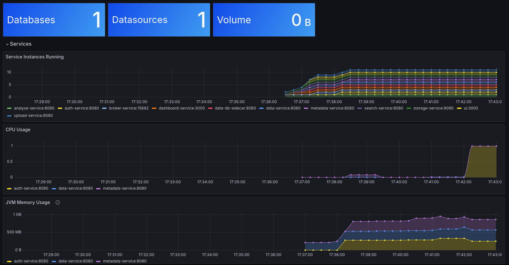
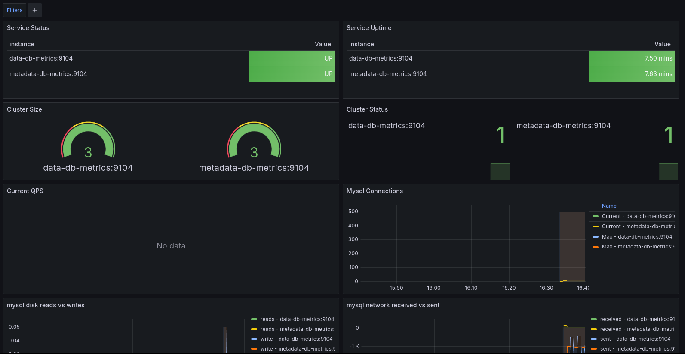
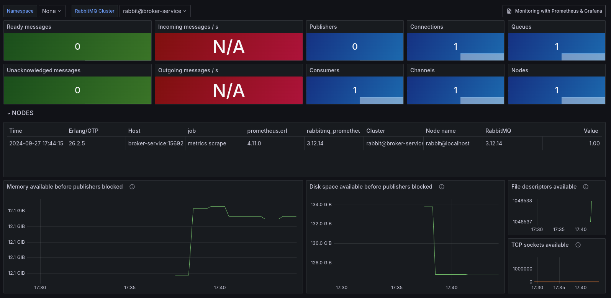

## tl;dr

!!! debug "Debug Information"

    Image: [`docker.io/bitnami/grafana:11.2.0-debian-12-r4`](https://hub.docker.com/r/bitnami/grafana)

    * Ports: `http://<hostname>/dashboard`
    * Prometheus: `http://<hostname>/dashboard/prometheus`

## Overview

The Dashboard Service is visualizing the status of DBRepo with charts. The default dashboard provisioner located in
`/etc/grafana/provisioning/dashboards/provider.yaml` checks for new `JSON` dashboard files in `/app/dashboards` every 10
seconds and makes the available in the Dashboard Service.

<figure markdown>

<figcaption>Figure 1: DBRepo Dashboard</figcaption>
</figure>

<figure markdown>

<figcaption>Figure 2: Database Dashboard</figcaption>
</figure>

<figure markdown>

<figcaption>Figure 3: Broker Service Dashboard</figcaption>
</figure>

## Limitations

!!! question "Do you miss functionality? Do these limitations affect you?"

    We strongly encourage you to help us implement it as we are welcoming contributors to open-source software and get
    in [contact](../../contact) with us, we happily answer requests for collaboration with attached CV and your programming 
    experience!

## Security

(none)
