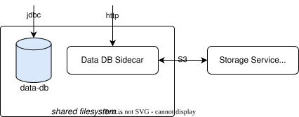

!!! debug "Debug Information"

    Image: [`bitnami/mariadb-galera:11.2.2-debian-11-r0`](https://hub.docker.com/r/bitnami/mariadb-galera)

    * Ports: 3306/tcp
    * JDBC: `jdbc://mariadb:<hostname>:3306`

!!! debug "Debug Information"

    Image: [`dbrepo/data-db-sidecar:1.4.4`](https://hub.docker.com/r/dbrepo/data-db-sidecar)

    * Ports: 8080/tcp

## Overview

By default, only one Data Database is deployed. You can deploy multiple (different) Data Database instances and make
them available in the repository as follows:

=== "Terminal"

    ```shell
    curl \
       -sSL \
       http://<hostname>/api/container \
       -X POST \
       -d '{"name": "Data Database 2", "imageId": 1, "host": "example.com", "port": 3306, "privilegedUsername": "root", "privilegedPassword": "s3cr3t" }'
    ```

### Settings

The procedures require the user-generated databases to have the same collation (because of comparison operations).
Ensure that the Data Database has the character set `utf8mb4` and collation `utf8mb4_general_ci` in your `my.cfg`:

```ini
[mysqld]
character_set_server=utf8mb4
collation_server=utf8mb4_general_ci
```

We observed this unexpected behavior for
the [MariaDB Galera chart](https://artifacthub.io/packages/helm/bitnami/mariadb-galera) powered by Bitnami and had to
set extra flags. We could not observe this behavior with
the [MariaDB Galera container image](https://hub.docker.com/r/bitnami/mariadb-galera) itself.

```yaml
mariadb-galera:
  extraFlags: "--character-set-server=utf8mb4 --collation-server=utf8mb4_general_ci"
```

### Sidecar

We deploy a sidecar that handles the CSV-file upload/download operations between
the [Storage Service](../system-services-storage) and the Data Database using a Python Flask application and
the [`boto3`](https://boto3.amazonaws.com/v1/documentation/api/latest/index.html) client until MariaDB supports S3
natively.

<figure markdown>

<figcaption>Sidecar that handles the CSV-file upload/download.</figcaption>
</figure>

### Backup

Export all databases with `--skip-lock-tables` option for MariaDB Galera clusters as it is not supported currently by
MariaDB Galera.

=== "Terminal"

    ```shell
    mariadb \
        -u <privilegedUsername> \
        -p<privilegedPassword> \
        --complete-insert \
        --skip-lock-tables \
        --skip-add-locks \
        --all-databases > dump.sql
    ```

### Restore

=== "Terminal"

    ```shell
    mariadb \
        -u <privilegedUsername> \
        -p<privilegedPassword> < dump.sql
    ```

## Limitations

(none)

!!! question "Do you miss functionality? Do these limitations affect you?"

    We strongly encourage you to help us implement it as we are welcoming contributors to open-source software and get
    in [contact](../contact) with us, we happily answer requests for collaboration with attached CV and your programming 
    experience!

## Security

(none)
