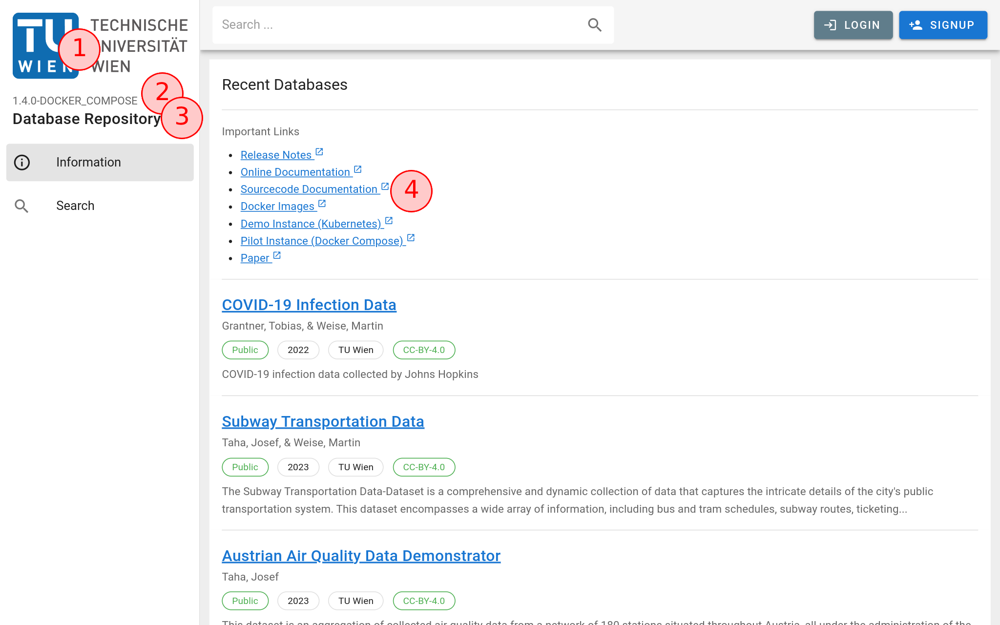

## tl;dr

!!! debug "Debug Information"

    Image: [`registry.datalab.tuwien.ac.at/dbrepo/ui:1.4.4`](https://hub.docker.com/r/dbrepo/ui)

    * Ports: 3000/tcp

The User Interface is configured in the `runtimeConfig` section of the `nuxt.config.ts` file during build time. For the
runtime, you need to override those values through environment variables or by mounting a `.env` file. As a small
example, you can configure the logo :material-numeric-1-circle-outline: in Figure 2. Make sure you mount the logo as
image as well, in this example we want to mount a custom logo `my_logo.png` into the container and specify the name.

<figure markdown>
{ .img-border }
<figcaption>Figure 1: Architecture of the UI microservice</figcaption>
</figure>

Text values like the version :material-numeric-2-circle-outline: and title :material-numeric-3-circle-outline: can be
configured as well via the Nuxt runtime configuration through single environment variables or `.env` files

```yaml title=".env"
NUXT_PUBLIC_TITLE="My overriden title"
NUXT_PUBLIC_LOGO="/app/.output/public/my_logo.png"
...
```

To work, you need to mount the `my_logo.png` file into the `dbrepo-ui` container via the `docker-compose.yml` file (or
if you use a Kubernetes deployment via ConfigMap and Volumes).

```yaml title="docker-compose.yml"
services:
  dbrepo-ui:
    image: registry.datalab.tuwien.ac.at/dbrepo/ui:1.4.4
    volumes:
      - ./my_logo.png:/app/.output/public/my_logo.png
  ...
```

### Architecture

The server-client architecture of the User Interface is shown in [Figure 3](#fig3), it is supposed to help debug the
User Interface on development.

<figure id="fig3" markdown>

<figcaption>Figure 2: Architecture of the User Interface</figcaption>
</figure>

* Runtime: [Bun 1+](https://bun.sh/) (preferred), *alternatively* Node.js 18+
* Builder: [Vite](https://vitejs.dev/)
* Server: [Nuxt.js 3+](https://nuxt.com/)
* Components: [Vue.js 3+](https://vuejs.org/)
* Frontend: [Vuetify 3+](https://vuetifyjs.com/en/)
* State: [Pinia](https://pinia.vuejs.org/)

### Example

See the [API Overview](..) page for detailed examples.

## Limitations

(none)

!!! question "Do you miss functionality? Do these limitations affect you?"

    We strongly encourage you to help us implement it as we are welcoming contributors to open-source software and get
    in [contact](../contact) with us, we happily answer requests for collaboration with attached CV and your programming 
    experience!

## Security

(none)
