## tl;dr

!!! debug "Debug Information"

    Image: [`tusproject/tusd:v1.12`](https://hub.docker.com/r/tusproject/tusd)

    * Ports: 1080/tcp
    * Prometheus: `http://<hostname>:1080/api/upload/metrics`
    * API: `http://<hostname>:1080/api/upload`
    * Swagger UI: <a href="../swagger/upload" target="_blank">:fontawesome-solid-square-up-right: view online</a>

## Overview

We use the [TUS](https://tus.io/) open protocol for resumable file uploads which based entirely on HTTP. Even though
the Upload Service is part of the standard installation, it is an entirely optional component and can be replaced with
any S3-compatible Blob Storage.

### Settings

The Upload Service is responsible for uploading files (mainly CSV-files) into a Blob Storage that can be accesses trough
the S3 protocol (e.g. our [Storage Service](../system-services-storage)). Make sure that the Upload Service can be
accessed from the Gateway Service and set the url in the User Interface configuration file.

```json title="dbrepo.config.json"
{
    "upload": {
       "url": "example.com",
       "useSsl": true
    },
    ...
}
```

If your deployment is secured with SSL/TLS (recommended) set the `useSsl` variable to `true`.

### Architecture

The Upload Service communicates internally with the [Storage Service](../system-services-storage) (c.f. [Figure 1](#fig1)).

<figure id="fig1" markdown>

<figcaption>Figure 1: Architecture of the Upload Service</figcaption>
</figure>

## Limitations

* No support for authentication.

!!! question "Do you miss functionality? Do these limitations affect you?"

    We strongly encourage you to help us implement it as we are welcoming contributors to open-source software and get
    in [contact](../contact) with us, we happily answer requests for collaboration with attached CV and your programming 
    experience!

## Security

1. We strongly encourage to limit the clients allowed to upload by adding your subnet, e.g. `128.130.0.0/16` 
   (=TU Wien subnet) to the [Gateway Service](../system-services-gateway) configuration file like this:

       ```nginx title="dbrepo.conf"
       location /api/upload {
         allow 128.130.0.0/16;
         deny all;
         ...
       }
       ```
