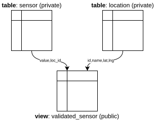

There are several ways to set the visibility of (meta-)data in DBRepo. It is possible to set the data to public/private
and the schema to be public/private for each database and separately for each table, each view and each subset of a
database. 

In total there are three possible scenarios:

## Public

!!! info "Possible use-case: data publication supplement to an open-access publication"

Where the database's data and metadata is set to be *public*. This means everything in the database (tables, views,
subsets) are visible by anyone from the public.

## Mixed

!!! info "Possible use-case: private sensor measurements with timed embargo"

Where the database's data and metadata is set to be *private*. This means everything in the database (tables, views,
subsets) are by default not visible by anyone from the public. You can however make specific views that join tables
and/or filter certain columns and apply a 14-day delay-embargo.

<figure markdown>

<figcaption>Figure 1: Public view that joins two private tables and applies a time-embargo</figcaption>
</figure>

## Private

!!! info "Possible use-case: data storage for trusted-/virtual research environments"