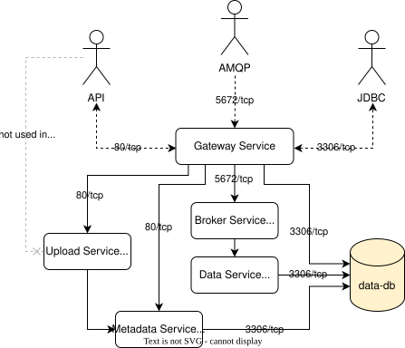

## Relational Database

TBD

## Query

TBD

## System Versioning

TBD

## Data Ingest

<figure markdown>

<figcaption>Figure 1: Modes of data ingest</figcaption>
</figure>

More [usage examples](../usage-overview/) include how to ingest datasets, data dumps, live data, etc.

### Generation of Metadata in DBRepo

You can generate metadata e.g. UI tbd

!!! warning "Limitation"

    Only system-versioned tables are considered when generating metadata to tables. If your table is not system-versioned
    e.g. a base table, it will not be visible in the UI.