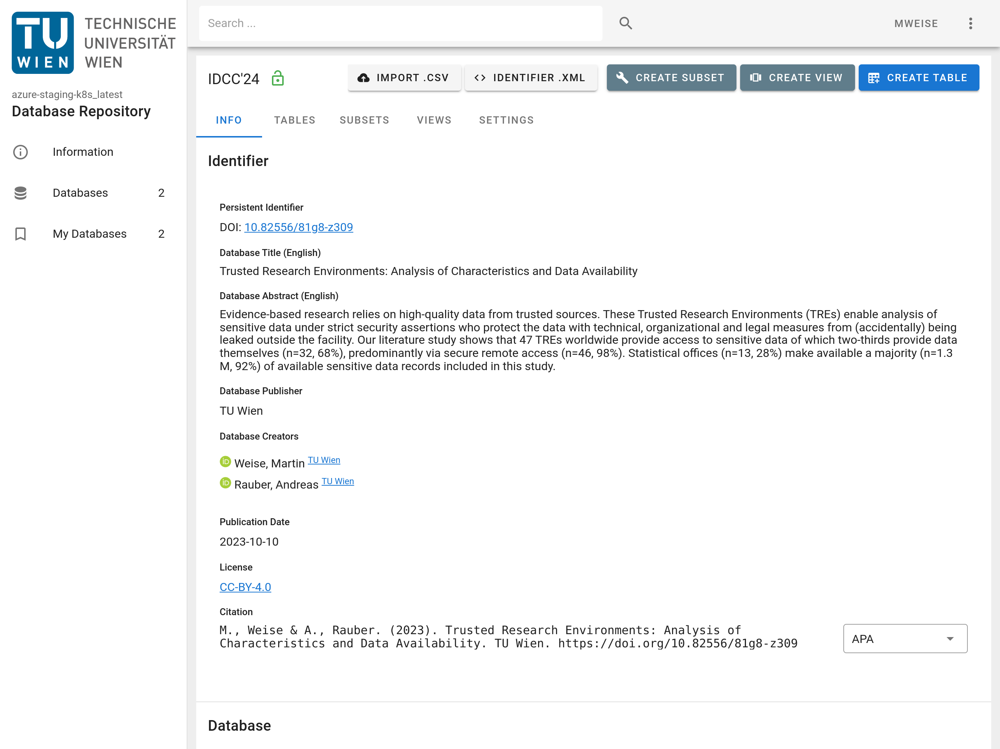

It provides a graphical interface for a researcher to interact with the API (c.f. Figure 1). 

<figure markdown>
{ .img-border }
<figcaption>Figure 1: User Interface</figcaption>
</figure>

For examples on how to use the User Interface, visit the [API](../api/) page to find out how to create
users, databases and how to import your data.

## Server / Client

TBD

## Cache

TBD