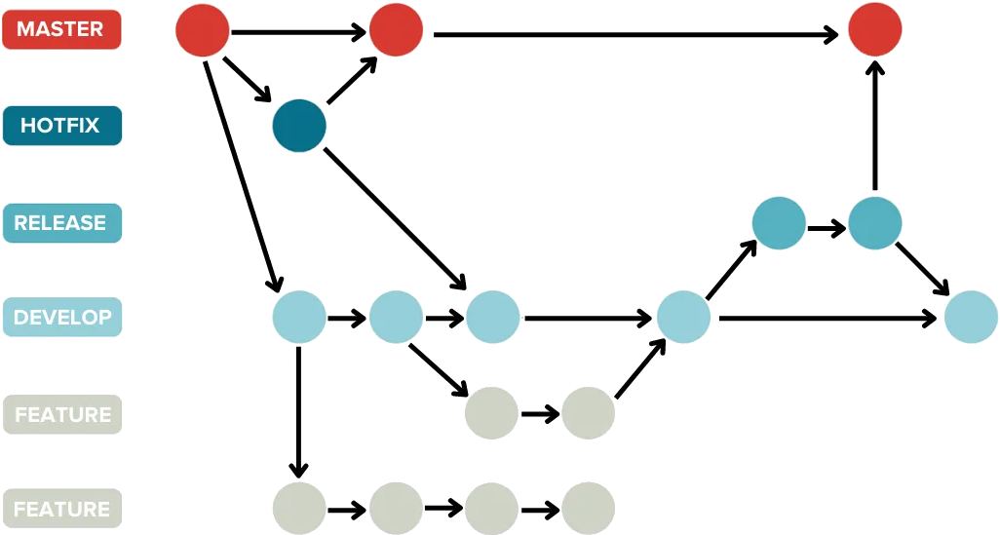
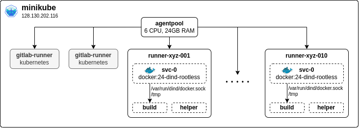

We welcome contributions to DBRepo!

## Dependencies

Local development depends on the following packages for Debian 12:

```shell
apt install -y maven openjdk-17-jdk make
```

Required tools with their own installing guides:

* [Docker Engine](https://docs.docker.com/engine/install/) 24+
* [Minikube](https://minikube.sigs.k8s.io/docs/start/) 1.32.0

## Getting Started

The Java-based services share some classes from the `metadata-service`. You need to install them locally as Maven
library via:

```shell
mvn -f ./dbrepo-metadata-service/pom.xml clean install -DskipTests
```

## Testing

We practice test-driven development and require contributors to test their code with at least 90% code coverage.

```shell
make test
```

The Java-based services have the coverage reports generated by `JaCoCo` in the `report/site/` subdirectory, the
Python-based services have the coverage reports generated by `coverage` in the `.coverage` SQLite3 database
and `coverage.txt` log file respectively.

We run SonarQube quality checks on the `master` branch regularly to ensure security, maintainability and remove code
smells. The internal instance can be found at [http://57.153.70.97:9000](http://57.153.70.97:9000)
(requires internal authentication).

## Code Versioning

### Branching Strategy

<figure markdown>

<figcaption>Figure 1: Branching strategy of the source code development.</figcaption>
</figure>

### CI/CD

We get compute resources in-kind from [dataLAB](https://www.it.tuwien.ac.at/en/services/network-and-servers/datalab)
to run our pipeline:

<figure markdown>

<figcaption>Figure 2: Gitlab runner configuration in the cluster.</figcaption>
</figure>

Minikube cluster with 6vCPU and 28GB RAM. The CI pipeline is configured as follows in the `config.toml`:

```toml
concurrent = 10
[[runners]]
  executor = "kubernetes"
  environment = [
    "FF_USE_LEGACY_KUBERNETES_EXECUTION_STRATEGY=false"
  ]
  [runners.kubernetes]
    namespace = "{{.Release.Namespace}}"
    privileged = true
    allowed_services = ["docker:24-dind"]
    [[runners.kubernetes.services]]
      name = "docker:24-dind"
      command = [ "--registry-mirror=http://docker-io-mirror:80", "--insecure-registry=docker-io-mirror:80", "--registry-mirror=http://gcr-io-mirror:80", "--insecure-registry=gcr-io-mirror:80", "--registry-mirror=http://ghcr-io-mirror:80", "--insecure-registry=ghcr-io-mirror:80", "--registry-mirror=http://k8s-io-mirror:80", "--insecure-registry=k8s-io-mirror:80" ]
      alias = "docker"
    [[runners.kubernetes.volumes.empty_dir]]
      name = "rundind"
      mount_path = "/var/run/dind"
      medium = "Memory"
    [[runners.kubernetes.volumes.empty_dir]]
      name = "tmp"
      mount_path = "/tmp"
      medium = "Memory"
```

For each job in the CI/CD pipeline, a pod with three containers is started:

1. `build` the main build container, you can *freely* specify any image with `image: xyz` as base
2. `helper` the default helper container.
3. `svc-0` the Docker-in-Docker sidecar (rootless executed as user `rootless`/`1000`) exposing the Docker socket to the
   `build` container under `

*Note.* Only Docker-in-Docker (dind) is allowed as service in the pipeline currently. For each job, a
dind-sidecar container `svc-0` is started that exposes the Docker socket at `/var/run/dind/docker.sock` in the `build`
container you can freely configure how you want. We are aware this is not optimal as it exposes *root* privileges in the
cluster.

The full CI/CD pipeline Helm chart is documented in
the [`fda-deployment`](https://gitlab.phaidra.org/fair-data-austria-db-repository/fda-deployment/-/tree/master/charts/dbrepo-devops)
repository.

## Documentation

For consistency reasons across the documentation, the resolution needs to be 1280x800 (16:10 ratio)

## Roadmap

- [x] Q1: Python library, versioning in every component, bumping frontend versions, i18n
- [ ] Q2: Kubernetes deployment guidelines for OpenShift
- [ ] Q3: Frontend tests, database dashboards
- [ ] Q4: Release of 2.0.0
