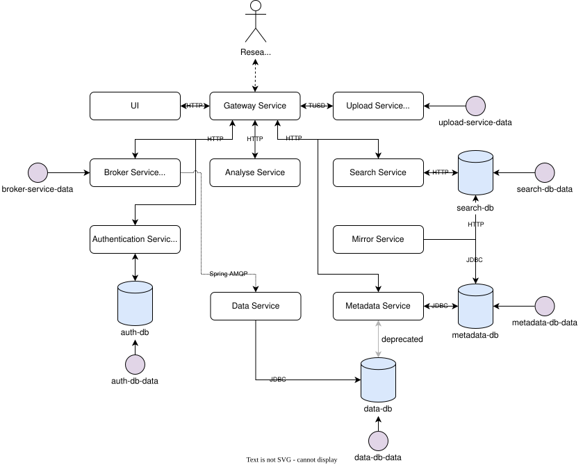
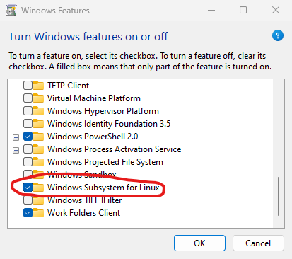

# Docker Compose

## TL;DR

If you have [Docker](https://docs.docker.com/engine/install/) already installed on your system, you can install DBRepo with:

```shell
curl -sSL https://gitlab.phaidra.org/fair-data-austria-db-repository/fda-services/-/raw/master/install.sh | bash
```

## Requirements

### Hardware

For this small, local, test deployment any modern hardware would suffice, we recommend a dedicated virtual machine with
the following settings.

- min. 8 vCPU cores
- min. 16GB RAM memory
- min. 200GB SSD storage
- min. 100Mbit/s connection

*Optional*: public IP-address if you want to secure the deployment with a (free) TLS-certificate from Let's Encrypt.

!!! tip "Resource Consumption"

    Note that most of the vCPU and RAM resources will be needed for starting the infrastructure, this is because of
    Docker. During operation and especially idle times, the deployment will use significantly less resources.

### Software

We only test the Docker Compose deployment with the 
official [Docker engine](https://docs.docker.com/engine/install/debian/) installed on 
a [Debian](https://www.debian.org/)-based operating system. Other software deployments (e.g. Docker Desktop on Windows)
are *not* recommended and not tested.

## Architecture

### Overview

The repository is designed as a service-based architecture to ensure scalability and the utilization of various
technologies. The conceptualized microservices operate the basic database operations, data versioning as well as
*findability*, *accessability*, *interoperability* and *reuseability* (FAIR).

<figure markdown>

<figcaption>Architecture of the services deployed via Docker Compose</figcaption>
</figure>

### Notes

Please note that we only save the state of the databases as well as the [Broker Service](../system-services-broker)
since RabbitMQ maintains state inside the container.

## Deployment

We maintain a rapid prototype deployment option through Docker Compose (v2.17.0 and newer). This deployment creates the
core infrastructure and a single Docker container for all user-generated databases.

=== ":simple-linux: Linux"

    Download and install [Docker Engine](https://docs.docker.com/desktop/install/linux-install/) for your Linux
    distribution. Although the installation might work, we *do not* recommend Docker Desktop.
    
    Ensure the Docker daemon is running at all times:

        systemctl enable docker --now

    Install DBRepo with the default configuration:

        curl -sSL https://gitlab.phaidra.org/fair-data-austria-db-repository/fda-services/-/raw/dev/install.sh | bash

=== ":simple-windows: Windows"

    Open `cmd.exe` as administrator and install WSL2 and the Debian subsystem:

        wsl --install Debian

    Open `optionalfeatures` by typing into the open terminal window or searching for it and enable "Windows Subsystem 
    for Linux":

    <figure markdown>
    { .img-border }
       <figcaption>Enable Subsystem for Linux in Windows Features</figcaption>
    </figure>

    Install [Docker Desktop](https://docs.docker.com/desktop/install/windows-install/) on the Windows host machine.
    Open Docker Desktop and go to settings (:fontawesome-solid-gear:) > General > Tick "Use WSL2 based engine" if not
    already ticked.

    Open the Debian container by typing "Debian" into the search, you should see a terminal window.

    Install DBRepo with the default configuration from the Debian container:

        curl -sSL https://gitlab.phaidra.org/fair-data-austria-db-repository/fda-services/-/raw/master/install.sh | bash

View the logs:

    docker compose logs -f

You should now be able to view the front end at [http://localhost](http://localhost).

Please be warned that the default configuration is not intended for public deployments. It is only intended to have a
running system within minutes to play around within the system and explore features. It is strongly advised to change 
the default `.env` environment variables.

### Troubleshooting

In case the deployment is unsuccessful, we have explanations on their origin and solutions to the most common errors:

**Are you trying to mount a directory onto a file (or vice-versa)?**

:   *Origin*:   Docker Compose does not find all files referenced in the `volumes` section of your `docker-compose.yml`
                file.
:   *Solution*: Ensure all mounted files in the `volumes` section of your `docker-compose.yml` exist and have correct
                file permissions (`0644`) to be found in the filesystem. Note that paths containing directories may not
                work when using Windows instead of the supported Linux.

**The Docker images have been updated but my deployment is not receiving the updates**

:   *Origin*:   Your local Docker image cache is not up-to-date and needs to fetch the remote changes.
:   *Solution*: Update your local Docker image cache by executing `docker compose pull`, it automatically downloads
                all Docker images that have updates. Then apply the new images with `docker compose up -d`.

## Security

!!! warning "Known security issues with the default configuration"

    The system is auto-configured for a small, local, test deployment and is *not* secure! You need to make modifications
    in various places to make it secure:

    * **Authentication Service**:

        a. You need to use your own instance or configure a secure instance using a (self-signed) certificate.
           Additionally, when serving from a non-default Authentication Service, you need to put it into the 
           `JWT_ISSUER` environment variable (`.env`).

        b. You need to change the default admin user `fda` password in Realm
           master > Users > fda > Credentials > Reset password.

        c. You need to change the client secrets for the clients `dbrepo-client` and `broker-client`. Do this in Realm
           dbrepo > Clients > dbrepo-client > Credentials > Client secret > Regenerate. Do the same for the
           broker-client.

        d. You need to regenerate the public key of the `RS256` algorithm which is shared with all services to verify 
           the signature of JWT tokens. Add your securely generated private key in Realm 
           dbrepo > Realm settings > Keys > Providers > Add provider > rsa.

    * **Broker Service**: by default, this service is configured with an administrative user that has major privileges.
      You need to change the password of the user *fda* in Admin > Update this user > Password. We found this
      [simple guide](https://onlinehelp.coveo.com/en/ces/7.0/administrator/changing_the_rabbitmq_administrator_password.htm)
      to be very useful.

    * **Search Database**: by default, this service is configured to require authentication with an administrative user
      that is allowed to write into the indizes. Following
      this [simple guide](https://www.elastic.co/guide/en/elasticsearch/reference/8.7/reset-password.html), this can be
      achieved using the command line.

    * **Gateway Service**: by default, no HTTPS is used that protects the services behind. You need to provide a trusted
      SSL/TLS certificate in the configuration file or use your own proxy in front of the Gateway Service. See this
      [simple guide](http://nginx.org/en/docs/http/configuring_https_servers.html) on how to install a SSL/TLS
      certificate on NGINX.

## Limitations

!!! info "Alternative Deployments"

    Alternatively, you can also deploy DBRepo with [Helm](../deployment-helm/) in your virtual machine instead.
