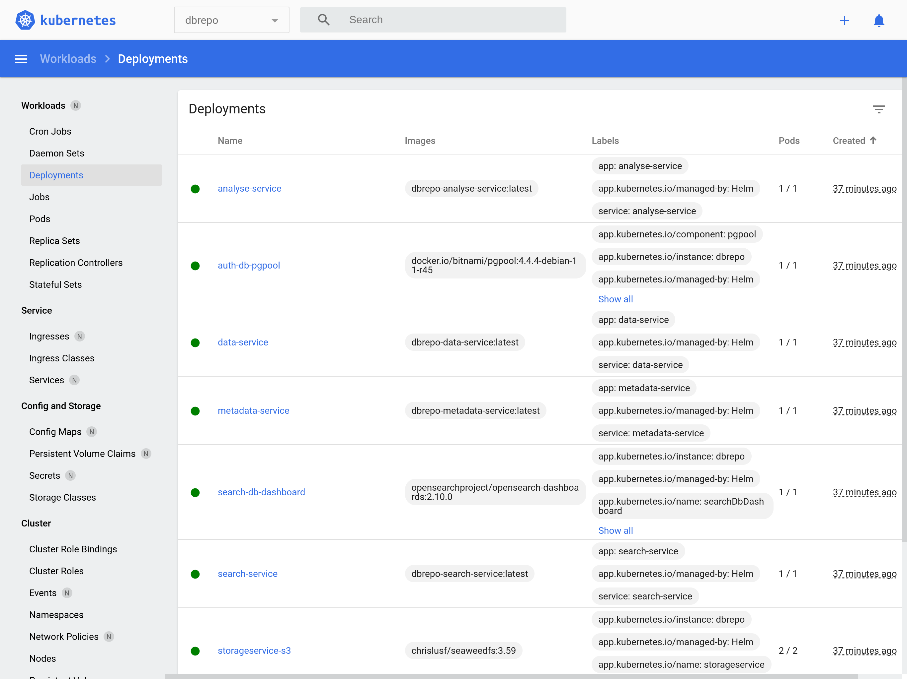

# Infrastructure Developer Guide

## tl;dr

```shell
make cluster-start cluster-image-pull cluster-install
```

## Dependencies

Local development depends on the following packages for Debian 12:

```shell
apt install -y make
```

Required tools with their own installing guides:

* [Docker Engine](https://docs.docker.com/engine/install/) 24+
* [Minikube](https://minikube.sigs.k8s.io/docs/start/) 1.32.0

## Getting Started

Start the local development cluster with the Docker driver (takes at least 8 vCPUs and 12GB RAM). It installs a Minikube
single-node Kubernetes cluster with enabled Ingress and Dashboard

```shell
make cluster-start
```

Build the local images with `make build-docker` and copy them to the cluster image cache:

```shell
make cluster-image-pull
```

Build and install the Helm chart:

```shell
make cluster-install
```

## Debug

Open the Minikube (Kubernetes) Dashboard:

```shell
make cluster-dashboard
```

<figure markdown>

<figcaption>Figure 1: Minikube Dashboard</figcaption>
</figure>

Optionally enable the Prometheus metrics addon with:

```shell
minikube addons enable metrics-server
```

## Test

Test if the Helm chart raises errors on start (the script aborts after 5 minutes automatically if some pods are not
starting or erroneous).

```shell
make cluster-test
```

## Uninstall

To uninstall DBRepo from the local Minikube cluster, removing all data:

```shell
make cluster-uninstall
```

