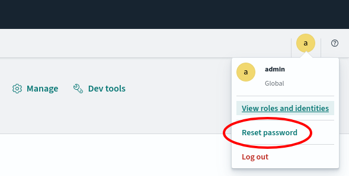

# Search Database

## tl;dr

!!! debug "Debug Information"

    Image: [`dbrepo/search-db:$TAG`](https://hub.docker.com/r/dbrepo/search-db)

    * Ports: 9200/tcp

## Overview

It processes search requests from the Gateway Service for full-text lookups in 
the [Metadata Database](../system-databases-metadata). We use [OpenSearch](https://opensearch.org/) in the default 
configuration and create a searchable index on all databases that is updated regularly by 
the [Mirror Service](../system-services-mirror).

All requests need to be authenticated, by default the credentials `admin:admin` are used.

Please see the [Search Database Dashboard](../system-other-search-dashboard) for information how to inspect the Search
Database more efficient.

## Limitations

(none)

!!! question "Do you miss functionality? Do these limitations affect you?"

    We strongly encourage you to help us implement it as we are welcoming contributors to open-source software and get
    in [contact](../contact) with us, we happily answer requests for collaboration with attached CV and your programming 
    experience!

## Security

1. Change the default credentials in the [Search Database Dashboard](../system-other-search-dashboard) with the default
   credentials `admin:admin` and navigate to your username on the top right and click "Reset password".

<figure markdown>
   { .img-border }
   <figcaption>Reset the admin password in Opensearch Dashboards</figcaption>
</figure>
