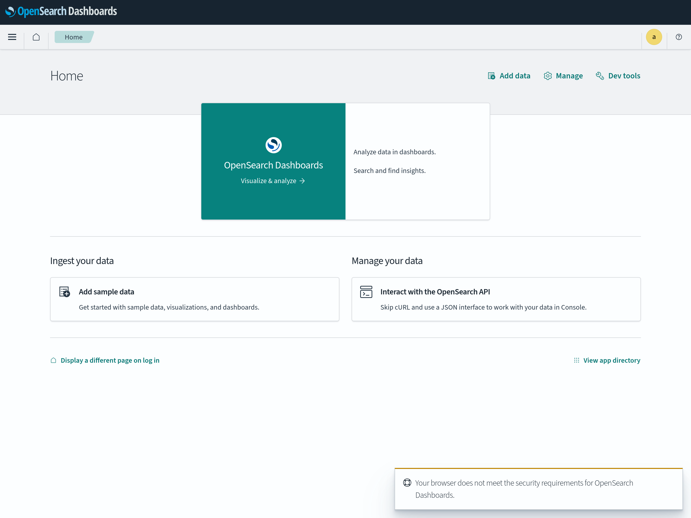

# Search Database Dashboard

## tl;dr

!!! debug "Debug Information"

    Image: [`opensearchproject/opensearch-dashboards:2.10.0`](https://hub.docker.com/r/opensearchproject/opensearch-dashboards)

    * Ports: 5601/tcp
    * UI: `http://<hostname>/admin/dashboard/`

## Overview

It provides a *graphical user interface* (GUI) for an administrator to interact with 
the [Search Database](../system-databases-search).

<figure markdown>
   { .img-border }
   <figcaption>Opensearch Dashboards on first start</figcaption>
</figure>

## Limitations

(none)

!!! question "Do you miss functionality? Do these limitations affect you?"

    We strongly encourage you to help us implement it as we are welcoming contributors to open-source software and get
    in [contact](../contact) with us, we happily answer requests for collaboration with attached CV and your programming 
    experience!

## Security

(none)
