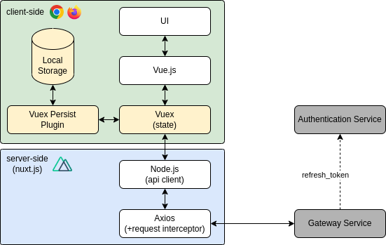

# UI

## tl;dr

!!! debug "Debug Information"

    Image: [`dbrepo/ui:latest`](https://hub.docker.com/r/dbrepo/ui)

    * Ports: 3000/tcp, 9100/tcp
    * Prometheus: `http://:9100/metrics`
    * UI: `http://:3000/`

## Overview

It provides a *user interface* (UI) for a researcher to interact with the database repository's API.

<figure markdown>
   { .img-border }
   <figcaption>User Interface</figcaption>
</figure>

<figure markdown>

<figcaption>Architecture of the UI microservice</figcaption>
</figure>

## Limitations

(none)

## Security

(none)
