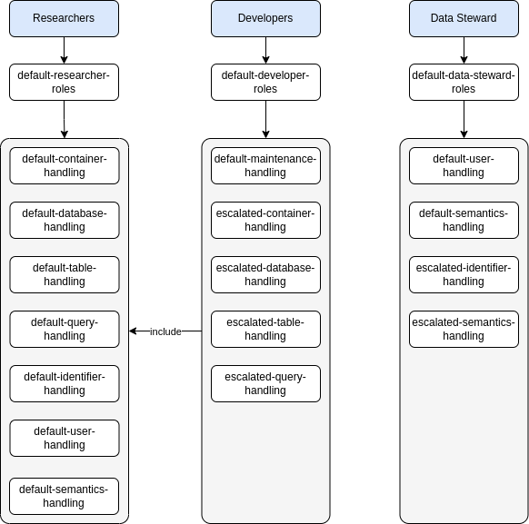

# Authentication Service

## tl;dr

!!! debug "Debug Information"

    Image: [`dbrepo/authentication-service:__APPVERSION__`](https://hub.docker.com/r/dbrepo/authentication-service)

    * Ports: 8080/tcp
    * UI: `http://<hostname>/api/auth/admin/`

## Overview

By default, users are created using the [User Interface](../system-other-ui) and the sign-up page in the User Interface.
This creates a new user in the [Authentication Database](../system-databases-authentication), the user identity is then managed by the
Authentication Service.

## Groups

The authorization scheme follows a group-based access control (GBAC). Users are organized in three distinct
(non-overlapping) groups:

1. Researchers (*default*)
2. Developers
3. Data Stewards

Based on the membership in one of these groups, the user is assigned a set of roles that authorize specific actions. By
default, all users are assigned to the `researchers` group.

## Roles

We organize the roles into default- and escalated composite roles. There are three composite roles, one for each group.
Each of the composite role has a set of other associated composite roles.

<figure markdown>

<figcaption>Three groups (Researchers, Developers, Data Stewards) and their composite roles associated.</figcaption>
</figure>

There is one role for one specific action in the services. For example: the `create-database` role authorizes a user to
create a database in a Docker container. Therefore,
the [`DatabaseEndpoint.java`](https://gitlab.phaidra.org/fair-data-austria-db-repository/fda-services/-/blob/a5bdd1e2169bae6497e2f7eee82dad8b9b059850/fda-database-service/rest-service/src/main/java/at/tuwien/endpoints/DatabaseEndpoint.java#L78)
endpoint requires a JWT access token with this authority.

```java
@PostMapping
@PreAuthorize("hasAuthority('create-database')")
public ResponseEntity<DatabaseBriefDto> create(@NotNull Long containerId,
                                               @Valid @RequestBody DatabaseCreateDto createDto,
                                               @NotNull Principal principal) {
...
}
```

### Default Container Handling

| Name                     | Description                          |
|--------------------------|--------------------------------------|
| `find-container`         | Can find a specific container        |
| `list-containers`        | Can list all containers              |

### Default Database Handling

| Name                         | Description                                          |
|------------------------------|------------------------------------------------------|
| `check-database-access`      | Can check the access to a database of a user         |
| `create-database`            | Can create a database                                |
| `create-database-access`     | Can give a new access to a database of a user        |
| `delete-database-access`     | Can delete the access to a database of a user        |
| `find-database`              | Can find a specific database in a container          |
| `list-databases`             | Can list all databases in a container                |
| `modify-database-visibility` | Can modify the database visibility (public, private) |
| `modify-database-owner`      | Can modify the database owner                        |
| `update-database-access`     | Can update the access to a database of a user        |

### Default Table Handling

| Name                            | Description                                          |
|---------------------------------|------------------------------------------------------|
| `create-table`                  | Can create a table                                   |
| `find-tables`                   | Can list a specific table in a database              |
| `list-tables`                   | Can list all tables                                  |
| `modify-table-column-semantics` | Can modify the column semantics of a specific column |
| `delete-table`                  | Can delete tables owned by the user in a database    |

### Default Query Handling

| Name                      | Description                                   |
|---------------------------|-----------------------------------------------|
| `create-database-view`    | Can create a view in a database               |
| `delete-database-view`    | Can delete a view in a database               |
| `delete-table-data`       | Can delete data in a table                    |
| `execute-query`           | Can execute a query statement                 |
| `export-query-data`       | Can export the data that a query has produced |
| `export-table-data`       | Can export the data stored in a table         |
| `find-database-view`      | Can find a specific database view             |
| `find-query`              | Can find a specific query in the query store  |
| `insert-table-data`       | Can insert data into a table                  |
| `list-database-views`     | Can list all database views                   |
| `list-queries`            | Can list all queries in the query store       |
| `persist-query`           | Can persist a query in the query store        |
| `re-execute-query`        | Can re-execute a query to reproduce a result  |
| `view-database-view-data` | Can view the data produced by a database view |
| `view-table-data`         | Can view the data in a table                  |
| `view-table-history`      | Can view the data history of a table          |

### Default Identifier Handling

| Name                | Description                                 |
|---------------------|---------------------------------------------|
| `create-identifier` | Can create an identifier (subset, database) |
| `find-identifier`   | Can find a specific identifier              |
| `list-identifier`   | Can list all identifiers                    |

### Default User Handling

| Name                      | Description                             |
|---------------------------|-----------------------------------------|
| `modify-user-theme`       | Can modify the user theme (light, dark) |
| `modify-user-information` | Can modify the user information         |

### Default Maintenance Handling

| Name                         | Description                              |
|------------------------------|------------------------------------------|
| `create-maintenance-message` | Can create a maintenance message banner  |
| `delete-maintenance-message` | Can delete a maintenance message banner  |
| `find-maintenance-message`   | Can find a maintenance message banner    |
| `list-maintenance-messages`  | Can list all maintenance message banners |
| `update-maintenance-message` | Can update a maintenance message banner  |

### Default Semantics Handling

| Name                      | Description                                                     |
|---------------------------|-----------------------------------------------------------------|
| `create-semantic-unit`    | Can save a previously unknown unit for a table column           |
| `create-semantic-concept` | Can save a previously unknown concept for a table column        |
| `execute-semantic-query`  | Can query remote SPARQL endpoints to get labels and description |
| `table-semantic-analyse`  | Can automatically suggest units and concepts for a table        |

### Escalated User Handling

| Name        | Description                                   |
|-------------|-----------------------------------------------|
| `find-user` | Can list user information for a specific user |

### Escalated Container Handling

| Name               | Description              |
|--------------------|--------------------------|
| `create-container` | Can create a container   |
| `delete-container` | Can delete any container |

### Escalated Database Handling

| Name              | Description                              |
|-------------------|------------------------------------------|
| `delete-database` | Can delete any database in any container |

### Escalated Table Handling

| Name                   | Description                          |
|------------------------|--------------------------------------|
| `delete-foreign-table` | Can delete any table in any database |

### Escalated Query Handling

| Name | Description |
|------|-------------|
| /    |             |

### Escalated Identifier Handling

| Name                         | Description                                       |
|------------------------------|---------------------------------------------------|
| `create-foreign-identifier`  | Can create an identifier to any database or query |
| `delete-identifier`          | Can delete any identifier                         |
| `modify-identifier-metadata` | Can modify any identifier metadata                |

### Escalated Semantics Handling

| Name                                    | Description                                  |
|-----------------------------------------|----------------------------------------------|
| `create-ontology`                       | Can register a new ontology                  |
| `delete-ontology`                       | Can unregister an ontology                   |
| `list-ontologies`                       | Can list all ontologies                      |
| `modify-foreign-table-column-semantics` | Can modify any table column concept and unit |
| `update-ontology`                       | Can update ontology metadata                 |
| `update-semantic-concept`               | Can update own table column concept          |
| `update-semantic-unit`                  | Can update own table column unit             |

## Limitations

* No support for sending e-mails through Keycloak by default.
* No support for temporary passwords.
* No support for adding identifies in Keycloak directly.
* No support for multi-factor authentication.

!!! question "Do you miss functionality? Do these limitations affect you?"

    We strongly encourage you to help us implement it as we are welcoming contributors to open-source software and get
    in [contact](../contact) with us, we happily answer requests for collaboration with attached CV and your programming 
    experience!

## Security

1. Mount your TLS certificate / private key pair into `/app/tls.crt` and `/app/tls.key` and 
   set `KC_HTTPS_CERTIFICATE_FILE=/app/tls.crt` and set `KC_HTTPS_CERTIFICATE_KEY_FILE=/app/tls.key`.
