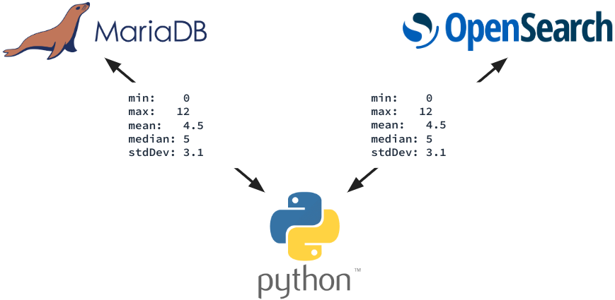
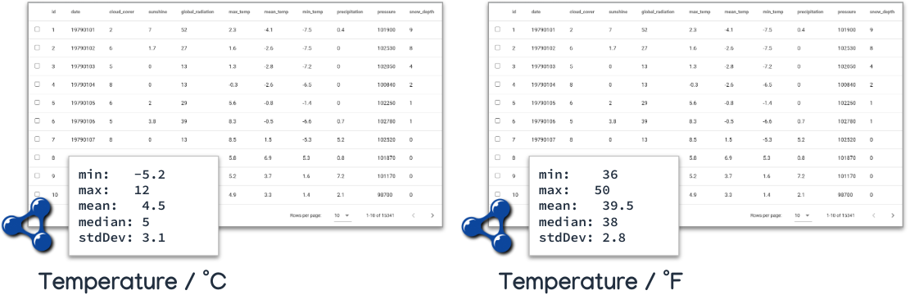
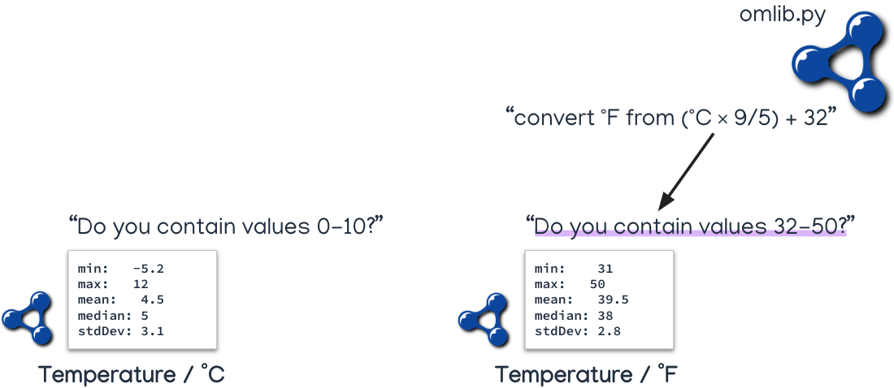

# Search Service

## tl;dr

!!! debug "Debug Information"

    Image: [`dbrepo/search-service:$TAG`](https://hub.docker.com/r/dbrepo/search-service)

    * Ports: 4000/tcp
    * Health: `http://<hostname>:4000/api/search/health`
    * Prometheus: `http://<hostname>:4000/metrics`
    * Swagger UI: `http://<hostname>:4000/swagger-ui/` <a href="../swagger/search" target="_blank">:fontawesome-solid-square-up-right: view online</a>

## Overview

This service communicates between the [Search Database](../system-databases-search) and 
the [User Interface](../system-other-ui) to allow structured search of databases, tables, columns, users, identifiers,
views, semantic concepts &amp; units of measurements used in databases.

## Index

There is only one 
index [`database`](https://gitlab.phaidra.org/fair-data-austria-db-repository/fda-services/-/raw/dev/dbrepo-search-db/init/indices/database.json)
that holds all the metadata information which is mirrored from the [Metadata Database](../system-databases-metadata).

<figure markdown>

<figcaption>Statistical properties in Metadata Database and Search Database</figcaption>
</figure>

## Faceted Browsing

This service enables the frontend to search the `database` index with eight different *types* of desired results 
(database, table, column, view, identifier, user, concept, unit) and their *facets*.

For example, the [User Interface](../system-other-ui) allows for the search of databases that contain a certain
semantic concept (provided as URI, e.g. 
temperature [http://www.wikidata.org/entity/Q11466](http://www.wikidata.org/entity/Q11466)) and unit of measurement 
(provided as URI, e.g. degree 
Celsius [http://www.ontology-of-units-of-measure.org/resource/om-2/degreeCelsius](http://www.ontology-of-units-of-measure.org/resource/om-2/degreeCelsius)).

An example on faceted browsing is found in the [usage examples](../usage-search).

## Unit Independent Search

Since the repository automatically collects statistical properties (min, max, mean, median, std.dev) in both the
[Metadata Database](../system-databases-metadata) and the [Search Database](../system-databases-search), a special
search can be performed when at least two columns have the same semantic concept (e.g. temperature) annotated and
the units of measurements can be transformed.

<figure markdown>

<figcaption>Two tables with compatible semantic concepts and units of measurement</figcaption>
</figure>

In short, the search service transforms the statistical properties not in the target unit of measurements is transformed
by using the [`omlib`](https://github.com/dieudonneWillems/OMLib) package. 

For example: a user wants to find datasets that contain *"temperature measurements between 0 - 10 &deg;C"*. Then the 
search service transforms the query to the dataset on the right from &deg;F to contain *"temperature measurements
between 32 - 50 &deg;F"* instead.

<figure markdown>

<figcaption>Unit independent search query transformation</figcaption>
</figure>

## Examples

See the [usage page](../usage-search).

## Limitations

!!! question "Do you miss functionality? Do these limitations affect you?"

    We strongly encourage you to help us implement it as we are welcoming contributors to open-source software and get
    in [contact](../contact) with us, we happily answer requests for collaboration with attached CV and your programming 
    experience!

## Security

(nothing)
