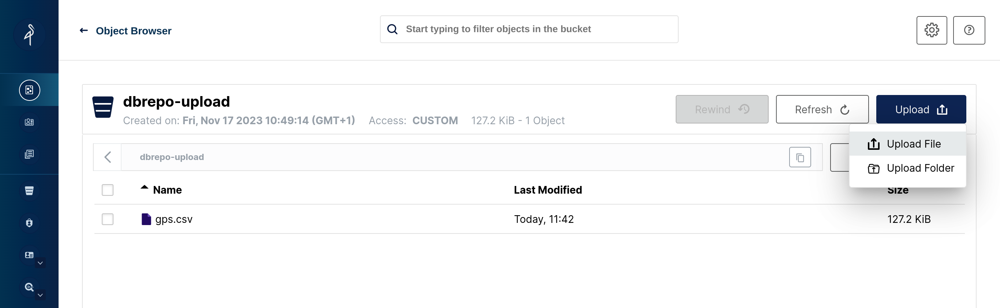
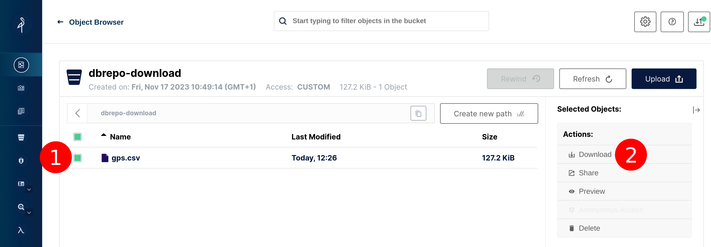

# Storage Service

## tl;dr

!!! debug "Debug Information"

    Image: [`bitnami/minio:2023-debian-11`](https://hub.docker.com/r/bitnami/minio)

    * Ports: 9000/tcp, 9001/tcp
    * Console: `http://<hostname>/admin/storage`

## Overview

We use [minIO](https://min.io) as a high-performance, S3 compatible object store packaged by Bitnami (VMware) for easy
cloud-ready deployments that by default support replication and monitoring.

### Users

The default configuration creates one user `minioadmin` with password `minioadmin`.

### Buckets

The default configuration creates two buckets `dbrepo-upload`, `dbrepo-download`:

* `dbrepo-upload` for CSV-file upload (for import of data, analysis, etc.) from the User Interface
* `dbrepo-download` for CSV-file download (exporting data, metadata, etc.)

### Metrics Collection

By default, Prometheus metrics are not enabled as they require a running Prometheus server in the background. You can
enable the metrics endpoint by setting the following environment variables in the `docker-compose.yml` (deployment with 
[Docker Compose](../deployment-docker-compose)) or `values.yml` (deployment with [Helm](../deployment-helm/)) according 
to the [minIO documentation](https://min.io/docs/minio/linux/operations/monitoring/collect-minio-metrics-using-prometheus.html).

### Examples

Upload a CSV-file into the `dbrepo-upload` bucket with the console 
via `http://<hostname>/admin/storage/browser/dbrepo-upload`.

<figure markdown>
   { .img-border }
   <figcaption>Uploading a file with the minIO console storage browser.</figcaption>
</figure>

Alternatively, you can use the middleware of the [User Interface](../system-other-ui/) to upload files.

Download a CSV-file from the `dbrepo-download` bucket with the console
via `http://<hostname>/admin/storage/browser/dbrepo-download`.

<figure markdown>
   { .img-border }
   <figcaption>Downloading a file with the minIO console storage browser.</figcaption>
</figure>

Alternatively, you can use a S3-compatible client:

* [minIO Client](https://min.io/docs/minio/linux/reference/minio-mc.html) (most generic implementation of S3)
* [boto3](https://boto3.amazonaws.com/v1/documentation/api/latest/index.html) (generic Python implementation of S3)
* AWS SDK (tailored towards Amazon S3)

## Limitations

* Prometheus metrics are not enabled by default (they require a running Prometheus server).

!!! question "Do you miss functionality? Do these limitations affect you?"

    We strongly encourage you to help us implement it as we are welcoming contributors to open-source software and get
    in [contact](../contact) with us, we happily answer requests for collaboration with attached CV and your programming 
    experience!

## Security

1. For public deployments, change the default credentials.
