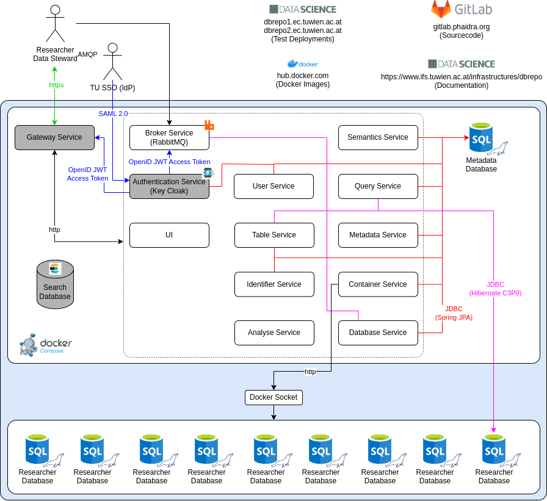

# System

!!! info "Abstract"

    This is the full system description from a technical/developer view.

We invite all open-source developers to help us fixing bugs and introducing features to the source code. Get involved by
sending a mail to Prof. Andreas Rauber and Projektass. Martin Weise.

## Architecture

The repository is designed as a microservice architecture to ensure scalability and the utilization of various
technologies. The conceptualized microservices operate the basic database operations, data versioning as well as
*findability*, *accessability*, *interoperability* and *reuseability* (FAIR).

<figure markdown>

<figcaption>Architecture</figcaption>
</figure>

## Services

View the docker images for the documentation of the service.

### Analyse Service

!!! debug "Debug Information"

    * Ports: 5000/tcp
    * Prometheus: `http://:5000/metrics`
    * Swagger UI: `http://:5000/swagger-ui/index.html` <a href="/infrastructures/dbrepo/swagger/analyse" target="_blank">:fontawesome-solid-square-up-right: view online</a>

It suggests data types for the FAIR Portal when creating a table from a *comma separated values* (CSV) file. It
recommends enumerations for columns and returns e.g. a list of potential primary key candidates. The researcher is able
to confirm these suggestions manually. Moreover, the *Analyze Service* determines basic statistical properties of
numerical columns.

### Authentication Service

!!! debug "Debug Information"

    * Ports: 8080/tcp, 8443/tcp
    * Admin Console: `http://:8443/`

Very specific to the deployment of the organization. In our reference implementation we implement a *security assertion
markup language* (SAML) service provider and use our institutional SAML identity provider for obtaining account data
through an encrypted channel.

From version 1.2 onwards we use Keycloak for authentication and deprecated the previous Spring Boot application.
Consequently,
the authentication will be through Keycloak.

!!! warning "Unsupported Keycloak features"

    Due to no demand at the time, we currently do not support the following Keycloak features:

    * E-Mail verification
    * Temporary passwords

By default, the Authentication Service comes with a self-signed certificate valid 3 months from build date. For
deployment it is *highly encouraged* to use your own certificate, properly issued by a trusted PKI, e.g. G&#201;ANT. For
local deployments you can use the self-signed certificate. You need to accept the risk in most browsers when visiting
the [admin panel](https://localhost:8443/admin/).

Sign in with the default credentials (username `fda`, password `fda`) or the one you configured during set-up. Be
default, users are created using the frontend and the sign-up page. But it is also possible to create users from
Keycloak, they will still act as "self-sign-up" created users. Since we do not support all features of Keycloak, leave
out required user actions as they will not be enforced, also the temporary password.

Each user has attributes associated to them. In case you manually create a user in Keycloak directly, you need to add
them in Users > Add user > Attributes:

* `theme_dark` (*boolean*, default: false)
* `orcid` (*string*)
* `affiliation` (*string*)

#### Groups

The authorization scheme follows a group-based access control (GBAC). Users are organized in three distinct
(non-overlapping) groups:

1. Researchers (*default*)
2. Developers
3. Data Stewards

Based on the membership in one of these groups, the user is assigned a set of roles that authorize specific actions. By
default, all users are assigned to the `researchers` group.

#### Roles

We organize the roles into default- and escalated composite roles. There are three composite roles, one for each group.
Each of the composite role has a set of other associated composite roles.

<figure markdown>

<figcaption>Three groups (Researchers, Developers, Data Stewards) and their composite roles associated.</figcaption>
</figure>

There is one role for one specific action in the services. For example: the `create-database` role authorizes a user to
create a database in a Docker container. Therefore,
the [`DatabaseEndpoint.java`](https://gitlab.phaidra.org/fair-data-austria-db-repository/fda-services/-/blob/a5bdd1e2169bae6497e2f7eee82dad8b9b059850/fda-database-service/rest-service/src/main/java/at/tuwien/endpoints/DatabaseEndpoint.java#L78)
endpoint requires a JWT access token with this authority.

```java
@PostMapping
@PreAuthorize("hasAuthority('create-database')")
public ResponseEntity<DatabaseBriefDto> create(@NotNull Long containerId,
                                               @Valid @RequestBody DatabaseCreateDto createDto,
                                               @NotNull Principal principal) {
...
}
```

##### Default Container Handling

| Name                     | Description                          |
|--------------------------|--------------------------------------|
| `create-container`       | Can create a container               |
| `find-container`         | Can find a specific container        |
| `list-containers`        | Can list all containers              |
| `modify-container-state` | Can start and stop the own container |

##### Default Database Handling

| Name                         | Description                                          |
|------------------------------|------------------------------------------------------|
| `check-database-access`      | Can check the access to a database of a user         |
| `create-database`            | Can create a database                                |
| `create-database-access`     | Can give a new access to a database of a user        |
| `delete-database-access`     | Can delete the access to a database of a user        |
| `find-database`              | Can find a specific database in a container          |
| `list-databases`             | Can list all databases in a container                |
| `modify-database-visibility` | Can modify the database visibility (public, private) |
| `modify-database-owner`      | Can modify the database owner                        |
| `update-database-access`     | Can update the access to a database of a user        |

##### Default Table Handling

| Name                            | Description                                          |
|---------------------------------|------------------------------------------------------|
| `create-table`                  | Can create a table                                   |
| `find-tables`                   | Can list a specific table in a database              |
| `list-tables`                   | Can list all tables                                  |
| `modify-table-column-semantics` | Can modify the column semantics of a specific column |

##### Default Query Handling

| Name                      | Description                                   |
|---------------------------|-----------------------------------------------|
| `create-database-view`    | Can create a view in a database               |
| `delete-database-view`    | Can delete a view in a database               |
| `delete-table-data`       | Can delete data in a table                    |
| `execute-query`           | Can execute a query statement                 |
| `export-query-data`       | Can export the data that a query has produced |
| `export-table-data`       | Can export the data stored in a table         |
| `find-database-view`      | Can find a specific database view             |
| `find-query`              | Can find a specific query in the query store  |
| `insert-table-data`       | Can insert data into a table                  |
| `list-database-views`     | Can list all database views                   |
| `list-queries`            | Can list all queries in the query store       |
| `persist-query`           | Can persist a query in the query store        |
| `re-execute-query`        | Can re-execute a query to reproduce a result  |
| `view-database-view-data` | Can view the data produced by a database view |
| `view-table-data`         | Can view the data in a table                  |
| `view-table-history`      | Can view the data history of a table          |

##### Default Identifier Handling

| Name                | Description                                 |
|---------------------|---------------------------------------------|
| `create-identifier` | Can create an identifier (subset, database) |
| `find-identifier`   | Can find a specific identifier              |
| `list-identifier`   | Can list all identifiers                    |

##### Default User Handling

| Name                      | Description                             |
|---------------------------|-----------------------------------------|
| `modify-user-theme`       | Can modify the user theme (light, dark) |
| `modify-user-information` | Can modify the user information         |

##### Default Maintenance Handling

| Name                         | Description                              |
|------------------------------|------------------------------------------|
| `create-maintenance-message` | Can create a maintenance message banner  |
| `delete-maintenance-message` | Can delete a maintenance message banner  |
| `find-maintenance-message`   | Can find a maintenance message banner    |
| `list-maintenance-messages`  | Can list all maintenance message banners |
| `update-maintenance-message` | Can update a maintenance message banner  |

##### Default Semantics Handling

| Name                      | Description                                                     |
|---------------------------|-----------------------------------------------------------------|
| `create-semantic-unit`    | Can save a previously unknown unit for a table column           |
| `create-semantic-concept` | Can save a previously unknown concept for a table column        |
| `execute-semantic-query`  | Can query remote SPARQL endpoints to get labels and description |
| `table-semantic-analyse`  | Can automatically suggest units and concepts for a table        |

##### Escalated User Handling

| Name        | Description                                   |
|-------------|-----------------------------------------------|
| `find-user` | Can list user information for a specific user |

##### Escalated Container Handling

| Name                             | Description                                  |
|----------------------------------|----------------------------------------------|
| `delete-container`               | Can delete any container                     |
| `modify-foreign-container-state` | Can modify any container state (start, stop) |

##### Escalated Database Handling

| Name              | Description                              |
|-------------------|------------------------------------------|
| `delete-database` | Can delete any database in any container |

##### Escalated Table Handling

| Name           | Description                          |
|----------------|--------------------------------------|
| `delete-table` | Can delete any table in any database |

##### Escalated Query Handling

| Name | Description |
|------|-------------|
| /    |             |

##### Escalated Identifier Handling

| Name                         | Description                                       |
|------------------------------|---------------------------------------------------|
| `create-foreign-identifier`  | Can create an identifier to any database or query |
| `delete-identifier`          | Can delete any identifier                         |
| `modify-identifier-metadata` | Can modify any identifier metadata                |

##### Escalated Semantics Handling

| Name                                    | Description                                  |
|-----------------------------------------|----------------------------------------------|
| `create-ontology`                       | Can register a new ontology                  |
| `delete-ontology`                       | Can unregister an ontology                   |
| `list-ontologies`                       | Can list all ontologies                      |
| `modify-foreign-table-column-semantics` | Can modify any table column concept and unit |
| `update-ontology`                       | Can update ontology metadata                 |
| `update-semantic-concept`               | Can update own table column concept          |
| `update-semantic-unit`                  | Can update own table column unit             |

#### API

##### Obtain Access Token

Access tokens are needed for almost all operations.

=== "Terminal"

    ``` console
    curl -X POST \
      -d "username=foo&password=bar&grant_type=password&client_id=dbrepo-client&scope=openid&client_secret=MUwRc7yfXSJwX8AdRMWaQC3Nep1VjwgG" \
      http://localhost/api/auth/realms/dbrepo/protocol/openid-connect/token
    ```

=== "Python"

    ``` py
    import requests

    auth = requests.post("http://localhost/api/auth/realms/dbrepo/protocol/openid-connect/token", data={
        "username": "foo",
        "password": "bar",
        "grant_type": "password",
        "client_id": "dbrepo-client",
        "scope": "openid",
        "client_secret": "MUwRc7yfXSJwX8AdRMWaQC3Nep1VjwgG"
    })
    print(auth.json()["access_token"])
    ```

##### Refresh Access Token

Using the response from above, a new access token can be created via the refresh token provided.

=== "Terminal"

    ``` console
    curl -X POST \
      -d "grant_type=refresh_token&client_id=dbrepo-client&refresh_token=THE_REFRESH_TOKEN&client_secret=MUwRc7yfXSJwX8AdRMWaQC3Nep1VjwgG" \
      http://localhost/api/auth/realms/dbrepo/protocol/openid-connect/token
    ```

=== "Python"

    ``` py
    import requests

    auth = requests.post("http://localhost/api/auth/realms/dbrepo/protocol/openid-connect/token", data={
        "grant_type": "refresh_token",
        "client_id": "dbrepo-client",
        "client_secret": "MUwRc7yfXSJwX8AdRMWaQC3Nep1VjwgG",
        "refresh_token": "THE_REFRESH_TOKEN"
    })
    print(auth.json()["access_token"])
    ```

### Broker Service

!!! debug "Debug Information"

    * Ports: 5672/tcp, 15672/tcp
    * RabbitMQ Management Plugin: `http://:15672`
    * RabbitMQ Prometheus Plugin: `http://:15692/metrics`

It holds exchanges and topics responsible for holding AMQP messages for later consumption. We
use [RabbitMQ](https://www.rabbitmq.com/) in the implementation. The AMQP endpoint listens to port `5672` for
regular declares and offers a management interface at port `15672`.

The default credentials are:

* Username: `fda`
* Password: `fda`

### Container Service

!!! debug "Debug Information"

    * Ports: 9091/tcp
    * Info: `http://:9091/actuator/info`
    * Health: `http://:9091/actuator/health`
    * Prometheus: `http://:9091/actuator/prometheus`
    * Swagger UI: `http://:9091/swagger-ui/index.html` <a href="/infrastructures/dbrepo/swagger/container" target="_blank">:fontawesome-solid-square-up-right: view online</a>

It is responsible for Docker container lifecycle operations and updating the local copy of the Docker images.

### Database Service

!!! debug "Debug Information"

    * Ports: 9092/tcp
    * Info: `http://:9092/actuator/info`
    * Health: `http://:9092/actuator/health`
    * Prometheus: `http://:9092/actuator/prometheus`
    * Swagger UI: `http://:9092/swagger-ui/index.html` <a href="/infrastructures/dbrepo/swagger/database" target="_blank">:fontawesome-solid-square-up-right: view online</a>

It creates the databases inside a Docker container and the Query Store. Currently, we only
support [MariaDB](https://mariadb.org/) images that allow table versioning with low programmatic effort.

### Gateway Service

!!! debug "Debug Information"

    * Ports: 9095/tcp
    * Info: `http://:9095/actuator/info`
    * Health: `http://:9095/actuator/health`
    * Prometheus: `http://:9095/actuator/prometheus`

Provides a single point of access to the *application programming interface* (API) and configures a 
standard [NGINX](https://www.nginx.com/) reverse proxy for load balancing, SSL/TLS configuration.

### Identifier Service

!!! debug "Debug Information"

    * Ports: 9096/tcp
    * Info: `http://:9096/actuator/info`
    * Health: `http://:9096/actuator/health`
    * Prometheus: `http://:9096/actuator/prometheus`
    * Swagger UI: `http://:9096/swagger-ui/index.html` <a href="/infrastructures/dbrepo/swagger/identifier" target="_blank">:fontawesome-solid-square-up-right: view online</a>

This microservice is responsible for creating and resolving a *persistent identifier* (PID) attached to a query to
obtain the metadata attached to it and allow re-execution of a query. We store both the query and hashes of the query
and result set to allow equality checks of the originally obtained result set and the currently obtained result set. In
the reference implementation we currently only use a numerical id column and plan to integrate *digital object
identifier* (DOI) through our institutional library soon.

### Metadata Database

!!! debug "Debug Information"

    * Ports: 3306/tcp, 9100/tcp
    * Prometheus: `http://:9100/metrics`

It is the core component of the project. It is a relational database that contains metadata about all researcher
databases
created in the database repository like column names, check expressions, value enumerations or key/value constraints and
relevant data for citing data sets. Additionally, the concept, e.g. URI of units of measurements of numerical columns is
stored in the Metadata Database in order to provide semantic knowledge context. We use MariaDB for its rich capabilities
in the reference implementation.

The default credentials are `root:dbrepo` for the database `fda`. Connect to the database via the JDBC connector on
port `3306`.

### Metadata Service

!!! debug "Debug Information"

    * Ports: 9099/tcp
    * Info: `http://:9099/actuator/info`
    * Health: `http://:9099/actuator/health`
    * Prometheus: `http://:9099/actuator/prometheus`
    * Swagger UI: `http://:9099/swagger-ui/index.html` <a href="/infrastructures/dbrepo/swagger/metadata" target="_blank">:fontawesome-solid-square-up-right: view online</a>

This service provides an OAI-PMH endpoint for metadata crawler.

### Query Service

!!! debug "Debug Information"

    * Ports: 9093/tcp
    * Info: `http://:9093/actuator/info`
    * Health: `http://:9093/actuator/health`
    * Prometheus: `http://:9093/actuator/prometheus`
    * Swagger UI: `http://:9093/swagger-ui/index.html` <a href="/infrastructures/dbrepo/swagger/query" target="_blank">:fontawesome-solid-square-up-right: view online</a>

It provides an interface to insert data into the tables created by the Table Service. It also allows for view-only,
paginated and versioned query execution to the raw data and consumes messages in the message queue from the Broker
Service.

### Search Database

!!! debug "Debug Information"

    * Ports: 9200/tcp
    * Indexes: `http://:9200/_all`
    * Health: `http://:9200/_cluster/health/`

It processes search requests from the Gateway Service for full-text lookups in the metadata database. We use
[Elasticsearch](https://www.elastic.co/) in the reference implementation. The search database implements Elastic Search
and creates a retrievable index on all databases that is getting updated with each save operation on databases in the
metadata database.

All requests need to be authenticated, by default the credentials `elastic:elastic` are used.

### Semantics Service

!!! debug "Debug Information"

    * Ports: 9097/tcp
    * Info: `http://:9097/actuator/info`
    * Health: `http://:9097/actuator/health`
    * Prometheus: `http://:9097/actuator/prometheus`
    * Swagger UI: `http://:9097/swagger-ui/index.html` <a href="/infrastructures/dbrepo/swagger/semantics" target="_blank">:fontawesome-solid-square-up-right: view online</a>

It is designed to map terms in the domain of units of measurement to controlled vocabulary, modelled in
the [ontology of units of measure](https://github.com/HajoRijgersberg/OM). This service validates researcher provided in
units and provides a *uniform resource identifier* (URI) to the related concept, which will be stored in the system.
Furthermore, there is a method for auto-completing text and listing a description as well as commonly used unit symbols.

### Table Service

!!! debug "Debug Information"

    * Ports: 9094/tcp
    * Info: `http://:9094/actuator/info`
    * Health: `http://:9094/actuator/health`
    * Prometheus: `http://:9094/actuator/prometheus`
    * Swagger UI: `http://:9094/swagger-ui/index.html` <a href="/infrastructures/dbrepo/swagger/table" target="_blank">:fontawesome-solid-square-up-right: view online</a>

This microservice handles table operations inside a database that is managed by the Database Service. We
use [Hibernate](https://hibernate.org/orm/) for schema and data ingest operations.

### UI

!!! debug "Debug Information"

    * Ports: 3000/tcp, 9100/tcp
    * Prometheus: `http://:9100/metrics`
    * UI: `http://:3000/`

It provides a *graphical user interface* (GUI) for a researcher to interact with the database repository's API.

<figure markdown>

<figcaption>Architecture of the UI microservice</figcaption>
</figure>

### User Service

!!! debug "Debug Information"

    * Ports: 9098/tcp
    * Info: `http://:9098/actuator/info`
    * Health: `http://:9098/actuator/health`
    * Prometheus: `http://:9098/actuator/prometheus`
    * Swagger UI: `http://:9098/swagger-ui/index.html` <a href="/infrastructures/dbrepo/swagger/user" target="_blank">:fontawesome-solid-square-up-right: view online</a>

This microservice handles user information.
