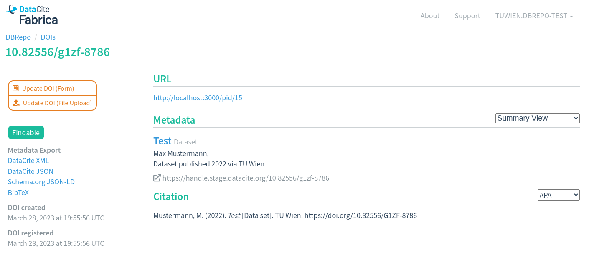

# Identifier Service

From version 1.2 onwards there are two modes for the Identifier Service:

1. Persistent Identifier (PID)
2. Digital Object Identifier (DOI)

By default, the URI mode is used, creating a PID for databases or subsets. If starting the Identifier Service in DOI mode,
a DOI is minted for persistent identification of databases or subsets. Using the DOI system is entirely *optional* and
should not be done for test-deployments.

<figure markdown>

<figcaption>Minting a test-DOI for a subset</figcaption>
</figure>
