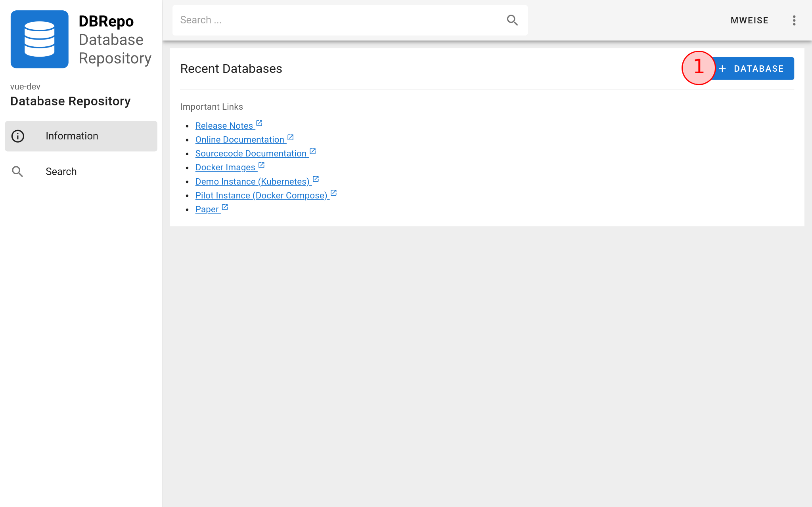
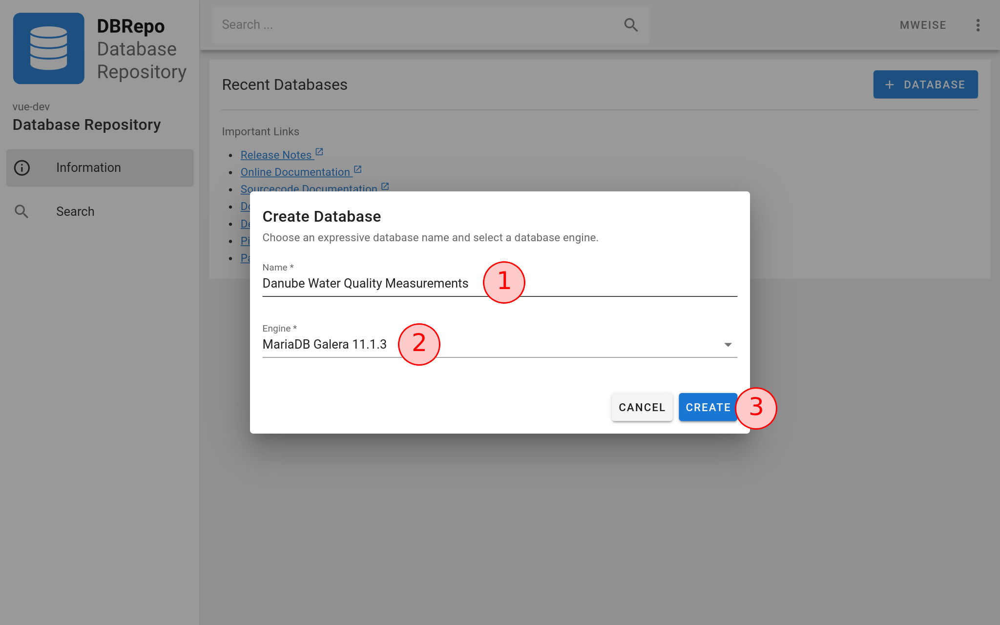
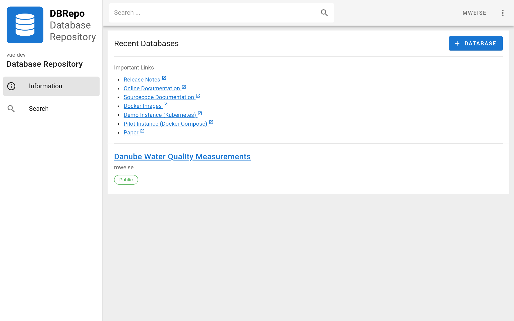
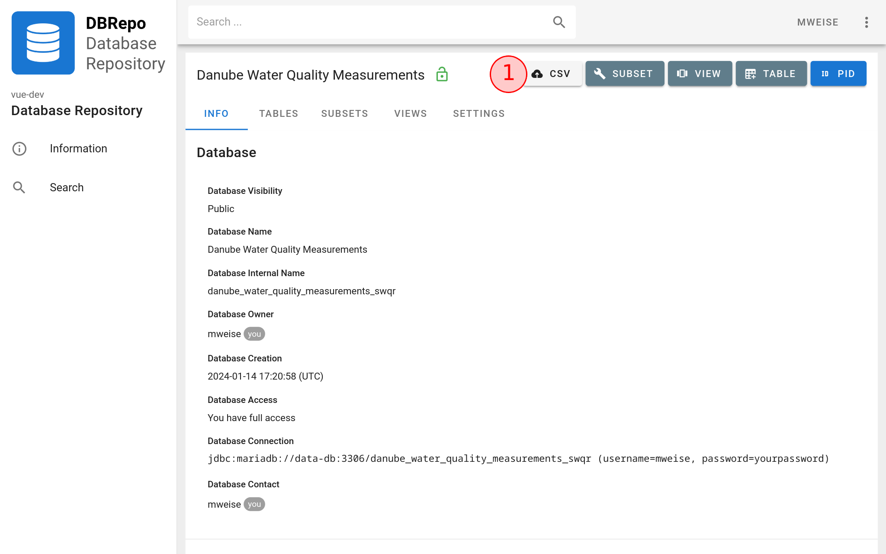
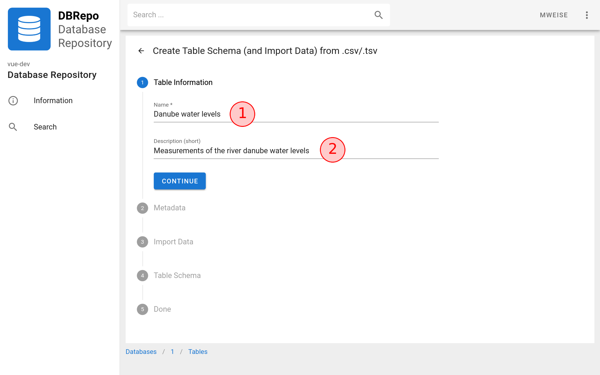
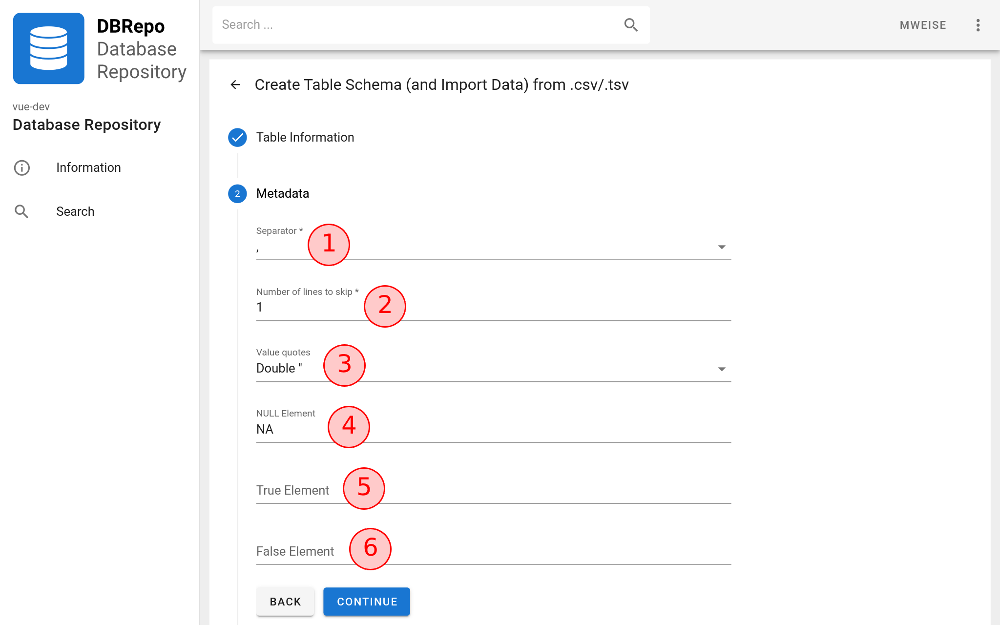
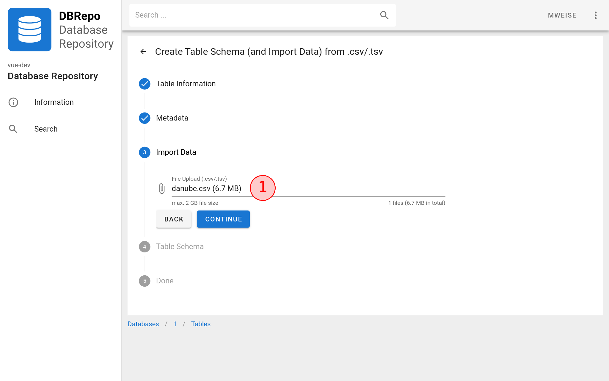
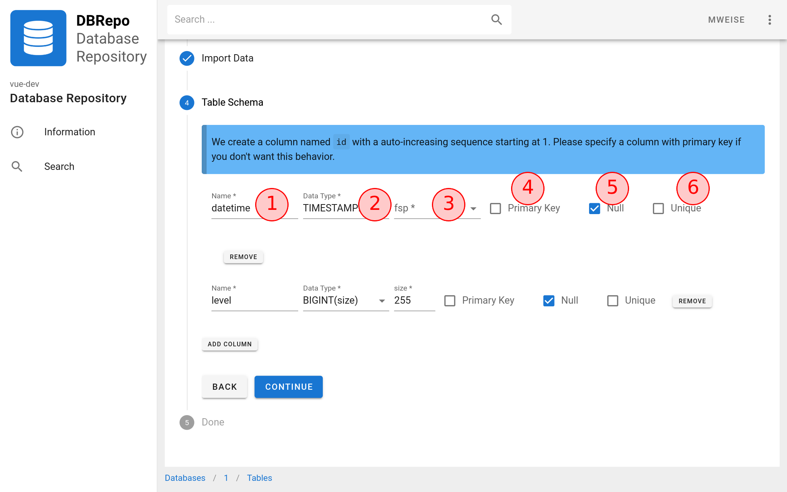
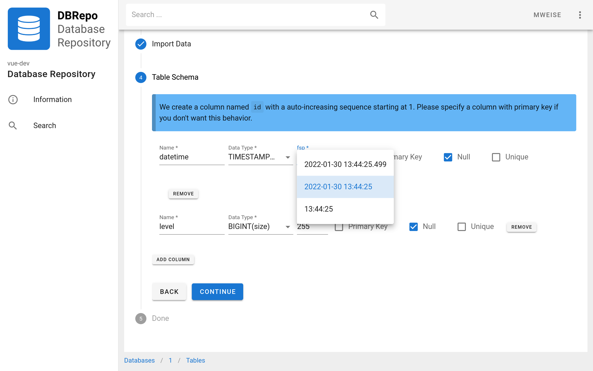
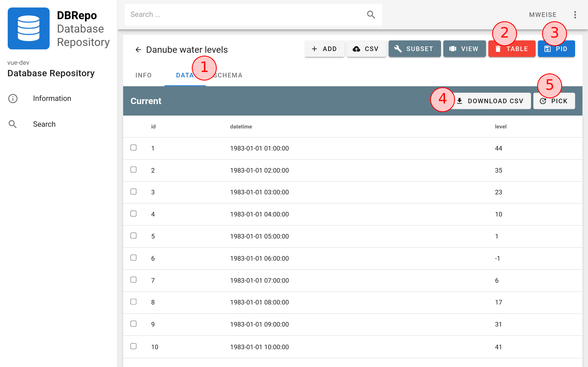

# Overview

We give usage examples of the seven most important use-cases we identified.

## Create Database

A user wants to create a database in DBRepo.

=== "UI"

    Login and press the ":material-plus: DATABASE" button on the top right :material-numeric-1-circle-outline: as seen in Figure 1.

    <figure markdown>
    { .img-border }
    <figcaption>Figure 1: Open the create database dialog.</figcaption>
    </figure>

    Give the database a meaningful title :material-numeric-1-circle-outline: that describes the contained data in few 
    words and select a pre-configured container :material-numeric-2-circle-outline: from the list for this database. To
    finally create the database, press "Create" :material-numeric-3-circle-outline: as seen in Figure 2.

    <figure markdown>
    { .img-border }
    <figcaption>Figure 2: Create database form.</figcaption>
    </figure>

    After a few seconds, you can see the created database in the "Recent Databases" list, as seen in Figure 3.

    <figure markdown>
    { .img-border }
    <figcaption>Figure 3: View the created database.</figcaption>
    </figure>

=== "Terminal"

    Obtain an access token:

    ```bash
    curl -sSL \
      -X POST \
      -d 'username=foo&password=bar&grant_type=password&client_id=dbrepo-client&scope=openid&client_secret=MUwRc7yfXSJwX8AdRMWaQC3Nep1VjwgG' \
      http://localhost/api/auth/realms/dbrepo/protocol/openid-connect/token | jq .access_token
    ```

    !!! note

        Please note that the `client_secret` is different for your DBRepo instance. This is a default client secret that
        likely has been replaced. Please contact your DBRepo administrator to get the `client_secret` for your instance.
        Similar you need to replace `localhost` with your actual DBRepo instance hostname, e.g. `test.dbrepo.tuwien.ac.at`.

    Then list all available containers with their database engine descriptions and obtain a container id.

    ```bash
    curl -sSL \
      http://localhost/api/container | jq
    ```

    Create a public databse with the container id from the previous step. You can also create a private database in this
    step, others can still see the metadata.

    ```bash
    curl -sSL \
      -X POST \
      -d '{"name":"Danube Water Quality Measurements","container_id":1,"is_public":true}' \
      http://localhost/api/database | jq .id
    ```

=== "Python"

    Obtain an access token:

    ```python
    import requests
    
    auth = requests.post("http://localhost/api/auth/realms/dbrepo/protocol/openid-connect/token", data={
        "username": "foo",
        "password": "bar",
        "grant_type": "password",
        "client_id": "dbrepo-client",
        "scope": "openid",
        "client_secret": "MUwRc7yfXSJwX8AdRMWaQC3Nep1VjwgG"
    })
    token = auth.json()["access_token"]
    print(token)
    ```

    !!! note

        Please note that the `client_secret` is different for your DBRepo instance. This is a default client secret that
        likely has been replaced. Please contact your DBRepo administrator to get the `client_secret` for your instance.
        Similar you need to replace `localhost` with your actual DBRepo instance hostname, e.g. `test.dbrepo.tuwien.ac.at`.

    Then list all available containers with their database engine descriptions and obtain a container id.

    ```python
    import requests
    
    containers = requests.get("http://localhost/api/container")
    print(containers.json())
    ```

    Create a public databse with the container id from the previous step. You can also create a private database in this
    step, others can still see the metadata.

    ```python
    import requests
    
    database = requests.post("http://localhost/api/database", headers={
        "Authentication": "Bearer " + token
    }, json={
        "name": "Danube Water Quality Measurements",
        "container_id": 1,
        "is_public": True
    })
    print(database.json()["id"])
    ```

## Import Dataset

A user wants to import a static dataset (e.g. from a .csv file) into a database that they have at least `write-own`
access to. This is the default for self-created databases like above in [Create Databases](#create-database).

=== "UI"

    Login and select a database where you have at least `write-all` access (this is the case for e.g. self-created 
    databases). Click the ":material-cloud-upload: IMPORT CSV" button :material-numeric-1-circle-outline: as seen in 
    Figure 4.

    <figure markdown>
    { .img-border }
    <figcaption>Figure 4: Open the import CSV form.</figcaption>
    </figure>

    Provide the table name :material-numeric-1-circle-outline: and optionally a table description :material-numeric-2-circle-outline:
    as seen in Figure 5.

    <figure markdown>
    { .img-border }
    <figcaption>Figure 5: Basic table information.</figcaption>
    </figure>

    Next, provide the dataset metadata that is necessary for import into the table by providing the dataset separator
    (e.g. `,` or `;` or `\t`) in :material-numeric-1-circle-outline:. If your dataset has a header line (the first line
    containing the names of the columns) set the number of lines to skip to 1 in field :material-numeric-2-circle-outline:.
    If your dataset contains more lines that should be ignored, set the number of lines accordingly. If your dataset
    contains quoted values, indicate this by setting the field :material-numeric-3-circle-outline: accordingly
    in Figure 6.

    If your dataset contains encodings for `NULL` (e.g. `NA`), provide this encoding information 
    in :material-numeric-4-circle-outline:. Similar, if it contains encodings for boolean `true` (e.g. `1` or `YES`),
    provide this encoding information in :material-numeric-5-circle-outline:. For boolean `false` (e.g. `0` or `NO`),
    provide this information in :material-numeric-6-circle-outline:.

    <figure markdown>
    { .img-border }
    <figcaption>Figure 6: Dataset metadata necessary for import.</figcaption>
    </figure>

    Select the dataset file from your local computer by clicking :material-numeric-1-circle-outline: or dragging the
    dataset file onto the field in Figure 7.

    <figure markdown>
    { .img-border }
    <figcaption>Figure 7: Dataset import file.</figcaption>
    </figure>

    The table schema is suggested based on heuristics between the upload and the suggested schema in Figure 8. If your
    dataset has no column names present, e.g. you didn't provide a *Number of lines to skip* (c.f. Figure 6), then you
    need to provide a column name in :material-numeric-1-circle-outline:. Provide a data type from the list of MySQL 8
    available data types :material-numeric-2-circle-outline:. Indicate if the column is (part of) a primary key 
    :material-numeric-4-circle-outline: or if `NULL` values are allowed in :material-numeric-5-circle-outline: or if a
    unique constraint is needed (no values in this column are then allowed to repeat) in :material-numeric-6-circle-outline:.

    Optionally, you can remove table column definitions by clicking the "REMOVE" button or add additional table column
    definitions by clicking the "ADD COLUMN" button in Figure 8.

    <figure markdown>
    { .img-border }
    <figcaption>Figure 8: Confirm the table schema and provide missing information.</figcaption>
    </figure>

    If a table column data type is of `DATE` or `TIMESTAMP` (or similar), provide a date format 
    :material-numeric-3-circle-outline: from the list of available formats that are most similar to the one in the
    dataset as seen in Figure 9.

    <figure markdown>
    { .img-border }
    <figcaption>Figure 9: Confirm the table schema and provide missing information.</figcaption>
    </figure>

    When you are finished with the table schema definition, the dataset is imported and a table is created. You are
    being redirected automatically to the table info page upon success, navigate to the "DATA" tab 
    :material-numeric-1-circle-outline:. You can still delete the table :material-numeric-2-circle-outline: as long as
    no identifier is associated with it :material-numeric-3-circle-outline:.

    Public databases allow anyone to download :material-numeric-4-circle-outline: the table data as dataset file. Also
    it allows anyone to view the recent history of inserted data :material-numeric-5-circle-outline: dialog.

    <figure markdown>
    { .img-border }
    <figcaption>Figure 10: Table data.</figcaption>
    </figure>

=== "Terminal"

    Obtain an access token:

    ```bash
    curl -sSL \
      -X POST \
      -d 'username=foo&password=bar&grant_type=password&client_id=dbrepo-client&scope=openid&client_secret=MUwRc7yfXSJwX8AdRMWaQC3Nep1VjwgG' \
      http://localhost/api/auth/realms/dbrepo/protocol/openid-connect/token | jq .access_token
    ```

    !!! note

        Please note that the `client_secret` is different for your DBRepo instance. This is a default client secret that
        likely has been replaced. Please contact your DBRepo administrator to get the `client_secret` for your instance.
        Similar you need to replace `localhost` with your actual DBRepo instance hostname, e.g. `test.dbrepo.tuwien.ac.at`.

    Select a database where you have at least `write-all` access (this is the case for e.g. self-created databases).

    Upload the dataset via the [`tusc`](https://github.com/adhocore/tusc.sh) terminal application or use Python and
    copy the file key.

    ```bash
    tusc -H http://localhost/api/upload/files -f danube.csv -b /dbrepo-upload/
    ```

    Analyse the dataset and get the table column names and datatype suggestion.

    ```bash
    curl -sSL \
      -X POST \
      -d '{"filename":"FILEKEY","separator":","}' \
      http://localhost/api/analyse/determinedt | jq
    ```

    Provide the table name and optionally a table description along with the table columns.

    ```bash
    curl -sSL \
      -X POST \
      -d '{"name":"Danube water levels","description":"Measurements of the river danube water levels","columns":[{"name":"datetime","type":"timestamp","dfid":1,"primary_key":false,"null_allowed":true},{"name":"level","type":"bigint","size":255,"primary_key":false,"null_allowed":true}]}' \
      http://localhost/api/database/1/table | jq .id
    ```

    Next, provide the dataset metadata that is necessary for import into the table by providing the dataset separator
    (e.g. `,` or `;` or `\t`). If your dataset has a header line (the first line containing the names of the columns) 
    set the number of lines to skip to 1. If your dataset contains more lines that should be ignored, set the number of
    lines accordingly. If your dataset contains quoted values, indicate this by setting the field accordingly.

    If your dataset contains encodings for `NULL` (e.g. `NA`), provide this encoding information. Similar, if it 
    contains encodings for boolean `true` (e.g. `1` or `YES`), provide this encoding information. For boolean `false`
    (e.g. `0` or `NO`), provide this information.

    ```bash
    curl -sSL \
      -X POST \
      -d '{"location":"FILEKEY","separator":",","quote":"\"","skip_lines":1,"null_element":"NA"}' \
      http://localhost/api/database/1/table/1/data/import | jq
    ```

    When you are finished with the table schema definition, the dataset is imported and a table is created. View the
    table data:

    ```bash
    curl -sSL \
      http://localhost/api/database/1/table/1/data?page=0&size=10 | jq
    ```

=== "Python"

    123

## Import Database Dump

TBD

=== "UI"

    ABC

=== "HTTP API"

    DEF

=== "JDBC API"

    123

## Import Live Data

TBD

=== "UI"

    ABC

=== "HTTP API"

    DEF

=== "JDBC API"

    123

=== "AMQP API"

    456

## Export Subset

TBD

=== "UI"

    ABC

=== "HTTP API"

    DEF

=== "JDBC API"

    123

## Assign Database PID

TBD

=== "UI"

    ABC

=== "HTTP API"

    DEF

## Private Database &amp; Access

TBD

=== "UI"

    ABC

=== "HTTP API"

    DEF