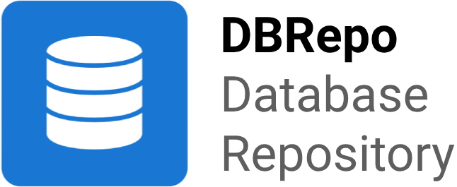

## tl;dr

If you have [Docker](https://docs.docker.com/engine/install/) already installed on your system, you can install DBRepo
with:

```bash
curl -sSL https://gitlab.phaidra.org/fair-data-austria-db-repository/fda-services/-/raw/release-1.4.3/install.sh | bash
```

## Documentation

Find a system description, component documentation and endpoint documentation
online: https://www.ifs.tuwien.ac.at/infrastructures/dbrepo/.

## Development

Contributions are always welcome and encouraged, please read the [contribution overview](./CONTRIBUTING.md) and
contact [Prof. Andreas Rauber](http://www.ifs.tuwien.ac.at/~andi/) or [Martin Weise](https://ec.tuwien.ac.at/~weise/).

## Docker

Recommended for getting familiar with the system.

### Run

After [building the docker containers](#build) you can run them using the default `docker-compose.yml` in the root of
the sourcecode directory. This starts all services in the background (as daemons hence the `-d` flag).

```shell
make start-dev
```

Optionally view all logs in real-time:

```shell
docker compose logs -f
```

## Kubernetes

Recommended for operational deployment.

See the [Helm Chart](https://artifacthub.io/packages/helm/dbrepo/dbrepo) on Artifact Hub.

## Acknowledgements

We want to thank the following organizations:

* [ARI&amp;Snet](https://forschungsdaten.at/en/arisnet/) for their continuous support in project work and funding.
* [TU.it &amp; .digital office](https://www.it.tuwien.ac.at/en/) for their continuous support in project
  work, [funding](https://www.tuwien.at/tu-wien/organisation/zentrale-bereiche/digital-office/projekte/dcall-2023-projekte)
  and compute resources provided in-kind.
* Bundesministerium für Bildung, Wissenschaft und Forschung (BMBWF) for funding during
  the [call](https://www.bmbwf.gv.at/Themen/HS-Uni/Aktuelles/Ausschreibung--Digitale-und-soziale-Transformation-in-der-Hochschulbildung-.html)
  "Digitale und soziale Transformation in der Hochschulbildung".

## Roadmap

* Q2/2024: Kubernetes deployment on major private cloud provisioners (OpenShift, Rancher, OpenStack).
* Q3/2024: Frontend tests, database dashboards
* Q4/2024: Release 2.0.0

## License

The source code is licensed under [Apache 2.0](https://opensource.org/licenses/Apache-2.0).